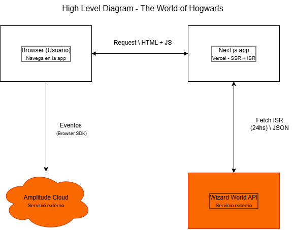
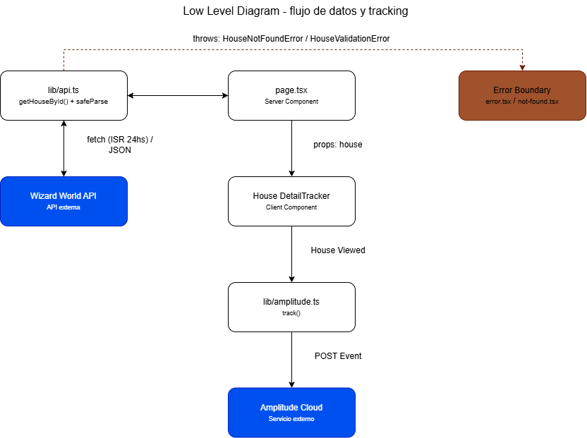

# The World of Hogwarts

Aplicación web que guía a nuevos miembros de un fanclub de Harry Potter por las casas de Hogwarts, construida como challenge técnico para Solutions Architect Jr en Minders. Consume la [Wizard World API](https://wizard-world-api.herokuapp.com/swagger/index.html) e instrumenta cada interacción de usuario con Amplitude.

## Stack

- **Next.js 16** (App Router) + **React 19** + **TypeScript**
- **Tailwind CSS v4**
- **Zod** — validación runtime de las respuestas de la Wizard World API
- **@amplitude/analytics-browser** — analytics de producto
- Deploy: **Vercel**

## Setup

```bash
npm install
cp .env.example .env.local
```

Completar en `.env.local`:

| Variable | Descripción |
|---|---|
| `NEXT_PUBLIC_WIZARD_API_URL` | Base URL de la Wizard World API |
| `NEXT_PUBLIC_AMPLITUDE_API_KEY` | API key del proyecto de Amplitude. Si se omite, el SDK simplemente no se inicializa (`instrumentation-client.ts`) |

```bash
npm run dev      # servidor de desarrollo
npm run build    # build de producción
npm run start    # servir el build
npm run lint     # eslint
```

## Arquitectura

Server Components por defecto; Client Components (`'use client'`) solo donde hace falta interactividad o tracking:

```
page.tsx (Server Component)
  → lib/api.ts (fetch + Zod safeParse)
  → props a Client Components (HouseCard, HouseDetailTracker, SelectHouseButton, TraitList)
  → lib/amplitude.ts (track / identifyUser)
  → Amplitude Cloud
```

- **`lib/api.ts`** — `getHouses()` / `getHouseById()`. Valida cada respuesta contra `HouseSchema` (Zod); si el shape no matchea, lanza `HouseValidationError` en vez de propagar datos sin validar. Cache con ISR (`revalidate: 86400`) — los datos de casas no cambian intra-día.
- **`lib/types.ts`** — `Person`, `Trait`, `House` como `z.infer<>` de sus schemas Zod.
- **`lib/houseColours.ts`** — deriva un acento de color de dos tonos a partir del campo libre `houseColours` de la API (ej. "Scarlet and gold"), sin hardcodear una tabla por nombre de casa.
- **Manejo de errores:** `HouseNotFoundError` → `notFound()` → `not-found.tsx`. Cualquier otro error (fetch fallido, `HouseValidationError`) → se loguea server-side (`console.error`) y se relanza un `Error` genérico → capturado por `error.tsx`, que muestra copy fijo + `error.digest` (sin exponer el mensaje real al usuario).

## Analytics (Amplitude)

Inicialización en `instrumentation-client.ts` (hook nativo de Next.js 16, corre antes de la hidratación de React), con autocapture de `pageViews`, `sessions` y `formInteractions`. Los eventos de interacción se instrumentan a mano para tener nombres semánticos (`elementInteractions: false`).

### Taxonomía de eventos (`lib/analytics/events.ts`)

| Evento | Dispara en | Propiedades |
|---|---|---|
| `House Viewed` | Montaje de la página de detalle | `house_id`, `house_name` |
| `House Card Clicked` | Click en una card del listado | `house_name`, `source` |
| `House Selected` | Click en "Esta es mi casa" | `house_name` |
| `Common Room Viewed` | Click en un trait de la casa | `house_id`, `trait_name` |
| `Navigation Link Clicked` | Cualquier navegación client-side | `from_page`, `to_page` |

### Lifecycle anónimo → conocido

Al seleccionar una casa favorita (`SelectHouseButton.tsx`), se genera/recupera un UUID persistido en `localStorage` y se llama `identifyUser()`, que ejecuta `amplitude.setUserId()` + `Identify().set('favorite_house', ...)` antes de trackear `House Selected`. Es el único punto de la app donde un usuario anónimo pasa a ser un usuario identificado.

## Diagramas

**High Level Diagram**



**Low Level Diagram** — flujo de datos y tracking (detalle de casa)


